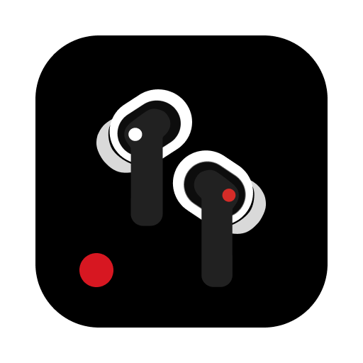

```
                                                                                  ⠀⠀⠀⠀⠀⠀⢀⣠⠤⠖⠛⠛⠓⠤⢤⣀⡀
 _   _ ___ _  _____  _        _ __   __  ____  _   _ ____ ___ _   _    _          ⠀⠀⠀⠀⣀⢞⡭⡅⠀⠀⠀⠀⠀⠀⢠⣬⣙⢦⡀
| \ | |_ _| |/ / _ \| |      / \\ \ / / |  _ \| | | | __ )_ _| \ | |  / \         ⠀⠀⠀⡴⢿⣵⠟⠁⠀⠀⠀⠀⠀⡀⠀⠳⣯⣻⢳⡀
|  \| || || ' / | | | |     / _ \\ V /  | | | | | | |  _ \| ||  \| | / _ \        ⠀⠀⢸⠁⠀⠤⠀⢠⣦⠀⠀⢠⡜⣧⠀⠀⠈⠁⢈⠁
| |\  || || . \ |_| | |___ / ___ \| |   | |_| | |_| | |_) | || |\  |/ ___ \       ⠀⠀⠸⡆⠀⡇⣴⢞⣚⡿⡄⡸⠟⣻⣗⣦⡀⠠⠎
|_| \_|___|_|\_\___/|_____/_/   \_\_|   |____/ \___/|____/___|_| \_/_/   \_\      ⠀⠀⠀⠹⡄⠙⢻⣿⣿⡟⠈⠀⠘⣿⣿⢿⠏⢹⡆
                                                                                  ⠀⠀⠀⠀⠹⢦⡈⢹⡏⠀⢀⡀⠀⠉⣱⢏⣠⠊
  ────────────────────────────────────────                                        ⠀⠀⠀⠀⠀⢀⣽⣾⣻⢳⣶⣶⠲⡿⢻⣍⡀
  role     Full-stack engineer · BI analyst · indie maker                         ⠀⠀⠀⢀⣴⣿⡿⢻⣧⣠⣿⣯⣀⣽⡿⣿⣿⣆
  env      macOS · Linux · Docker                                                 ⠀⠀⢐⡋⢹⠞⠁⢨⡛⠿⢻⠷⠾⠋⡟⠘⠫⣭⣷
  ────────────────────────────────────────                                        ⠀⠀⠀⠉⠀⠀⠀⢸⡝⠶⣜⣂⠴⢫⡟
  $ ./ship.sh — always building                                                   ⠀⠀⠀⠀⠀⠀⠀⢸⡷⣄⡼⢳⣠⠾⣝
                                                                                  ⠀⠀⠀⠀⠀⠀⠀⡰⠒⠚⡇⢰⠗⠒⢮
                                                                                  ⠀⠀⠀⠀⠀⠀⠀⠘⠶⠛⠁⠈⠛⠶⠞
```

[**inkover.ink**](https://inkover.ink) &nbsp;·&nbsp; [**Telegram @nikiomori**](https://t.me/nikiomori)

### `$ cat about.md`

**Currently** — data, BI &amp; [Куарка](https://kuarka.ru) at [AssistAgro](https://assistagro.com) / [AgroHistory](https://info.agrohistory.com); building [Pretype](https://pretype.app) &amp; [Inkover](https://inkover.ink) after hours.

### `$ ls ~/projects`

<table>
  <tr>
    <td valign="top" width="33%">
      <a href="https://pretype.app"></a>
      <b><a href="https://pretype.app">Pretype</a></b> <sub><code>building · OSS</code></sub><br/>
      <sub>On-device AI autocomplete for macOS.</sub>
    </td>
    <td valign="top" width="33%">
      <a href="https://kuarka.ru"></a>
      <b><a href="https://kuarka.ru">Куарка</a></b> <sub><code>@ AssistAgro</code></sub><br/>
      <sub>QR inventory tracking for agribusiness.</sub>
    </td>
    <td valign="top" width="33%">
      <a href="https://github.com/nikiomori/nothing-x-macos"></a>
      <b><a href="https://github.com/nikiomori/nothing-x-macos">Nothing X</a></b> <sub><code>OSS</code></sub><br/>
      <sub>macOS app for Nothing &amp; CMF earbuds.</sub>
    </td>
  </tr>
  <tr>
    <td valign="top" width="33%">
      <a href="https://tessera.nikiomori.com"></a>
      <b><a href="https://tessera.nikiomori.com">Tessera</a></b> <sub><code>OSS</code></sub><br/>
      <sub>Branded QR codes — self-hosted, MIT.</sub>
    </td>
    <td valign="top" width="33%">
      <a href="https://inkover.ink"></a>
      <b><a href="https://inkover.ink">Inkover</a></b> <sub><code>building</code></sub><br/>
      <sub>In-browser manga &amp; webtoon translation.</sub>
    </td>
    <td valign="top" width="33%">
      <a href="https://socribo.ru"></a>
      <b><a href="https://socribo.ru">Socribo</a></b><br/>
      <sub>AI autopilot for social media.</sub>
    </td>
  </tr>
  <tr>
    <td valign="top" width="33%">
      <a href="https://voxprint.app"></a>
      <b><a href="https://voxprint.app">VoxPrint</a></b><br/>
      <sub>Audio &amp; video → text, with diarization.</sub>
    </td>
    <td valign="top" width="33%">
      <a href="https://rent-stat.org"></a>
      <b><a href="https://rent-stat.org">Rent Stat</a></b><br/>
      <sub>Belarus rental market, AI-scored.</sub>
    </td>
    <td valign="top" width="33%">
      <a href="https://evauto.pro"></a>
      <b><a href="https://evauto.pro">EV Belarus</a></b><br/>
      <sub>The EV reference for Belarus.</sub>
    </td>
  </tr>
</table>

### `$ cat tech-stack.txt`

**Code** &nbsp;           

**Data &amp; Ops** &nbsp;             

